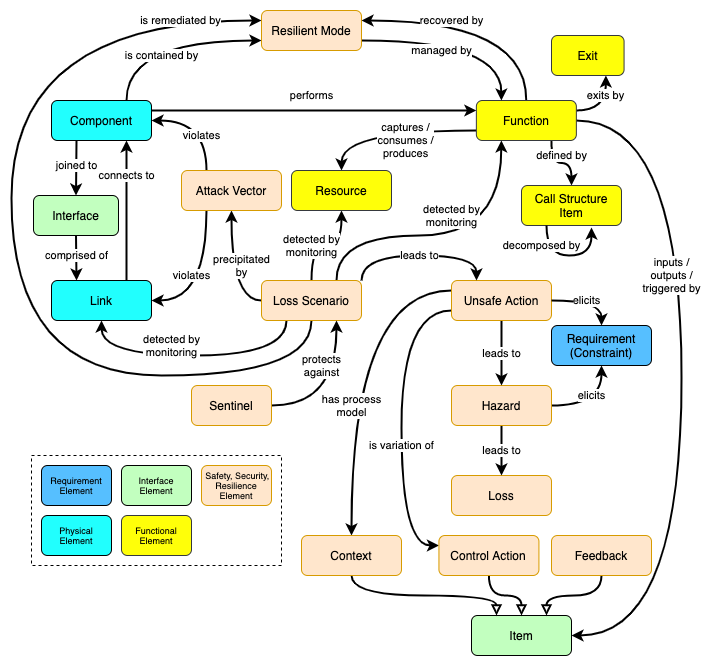

# CPS Metamodel

  

  <strong>CPS-Metamodel.</strong> The antidote to safety, security, and resilience coengineering.

## About the paper

Georgios Bakirtzis, Tim Sherburne, Stephen Adams, Barry M. Horowitz, Peter Beling, and Cody H. Fleming, "An ontological metamodel for cyber-physical system safety, security, and resilience coengineering" [preprint]

## GraphQL schema

[cps-metamodel.graphql](./cps-metamodel.graphql)
